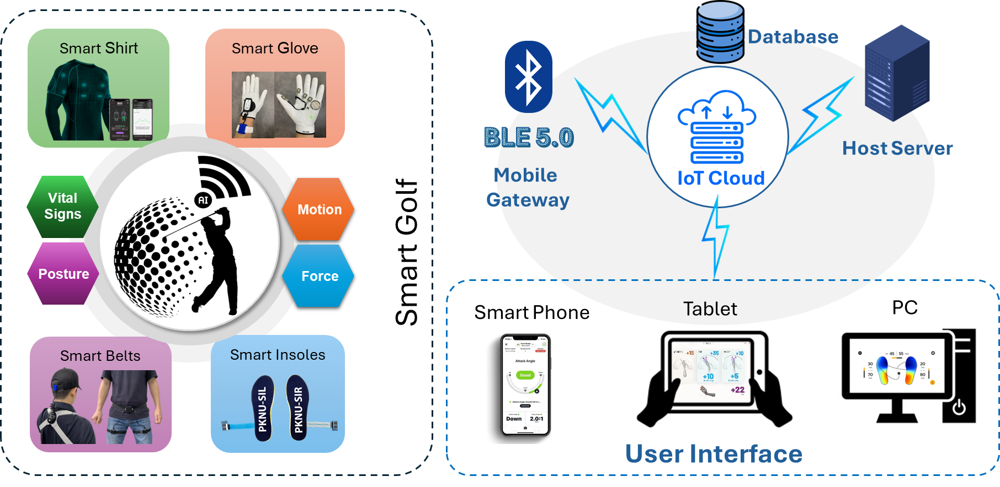
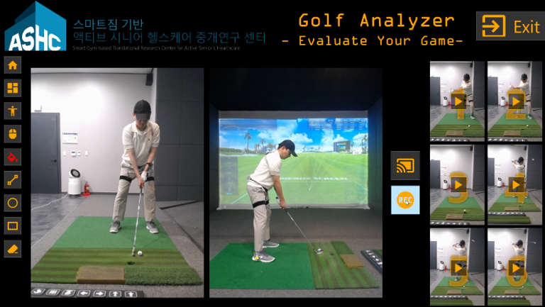
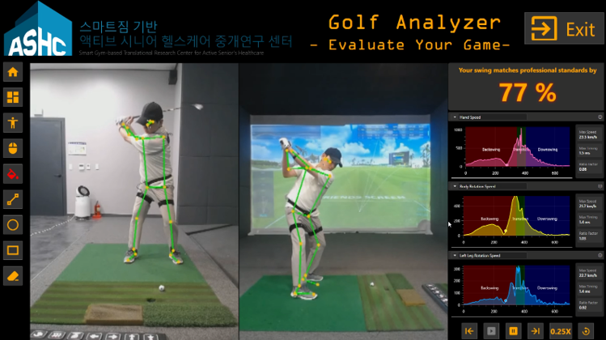

# Golf Analyzer System using Wearable Device

## Introduction

**Golf Analyzer System** is an intelligent performance monitoring system designed to analyze and improve a golfer’s swing and overall performance. The project aims to connect players, coaches, and training platforms through modern technology and data-driven insights, enhancing training efficiency and user experience.

## Key Features

- Hardware development for collecting swing-related data such as club speed, swing angle, and body motion.
- Software development for processing, analyzing, and visualizing swing performance metrics.
- Mobile application for real-time feedback, performance tracking, and personalized improvement tips.
- IoT integration for seamless data transmission from wearable devices to the cloud.
- Real-time motion and performance monitoring to help golfers refine their technique.
- Player and coach management for data sharing, progress tracking, and performance analysis.

## Demo

## Contact

- **Author:** Quy Phuong Le
- **Email:** lequyphuong1903@gmail.com

---

_Thank you for your interest in this project!_
